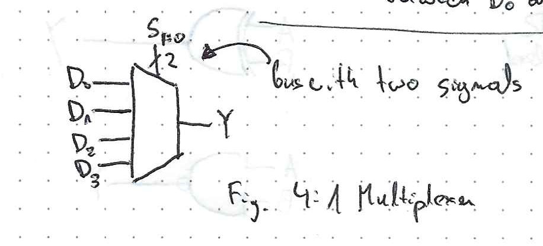
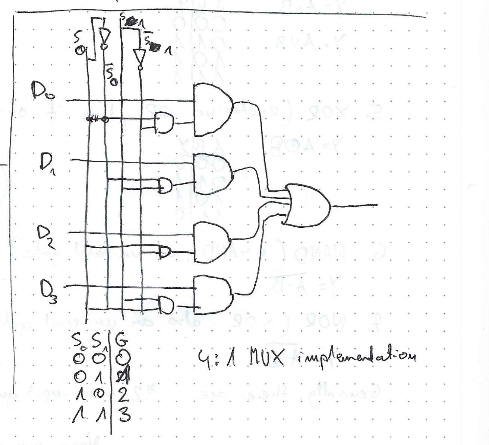
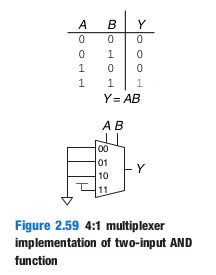
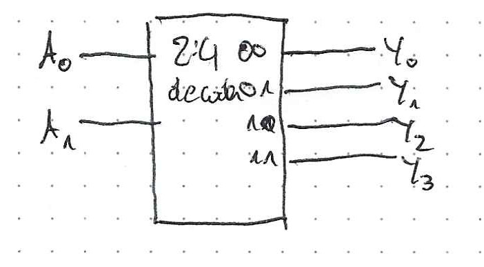
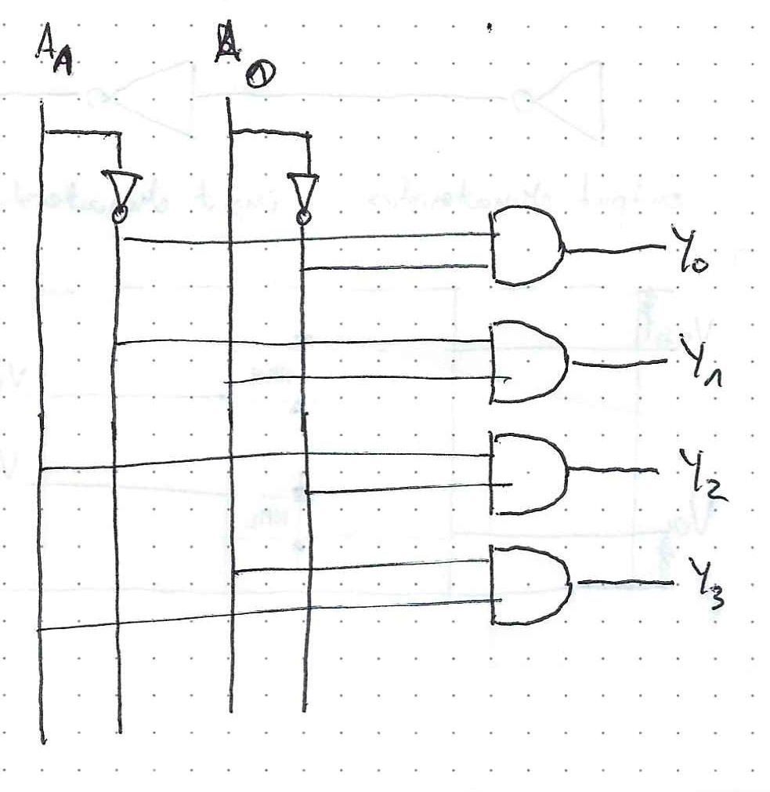

# X Z symbols

X - illegal value, e.g. when output is driven both to 0 and 1

Z - floating value _(high impedance)_

# Multiplexers 

_multiplexer_ - a combinational circuit that allows to select from one of N inputs to the output using log2(N) select signals

Many inputs to one output

MUX symbol

Mux implementation with combinational logic

You can implement any 2-input logic function on a 4:1 MUX. It's basically a physical ground truth lookup table.

# Decoders
__decoder__ - has N inputes and 2^N outputs.

IN: binary

OUT: one-hot

decoder symbol

2:4 decoder implementation

_notice how decoder is a part of multiplexer_