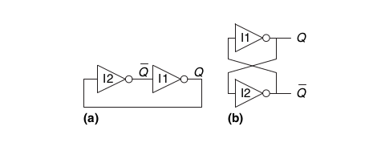

# Building elements of sequential logic

# Bistable element

Bistable element has stable two states and stores one bit of information.

More generally, an element with N states conveys log2(N bits of information.

(fig) Bistable element schematic.

Technically, there are no inputs for the user to control _(it would require 'fighting' the output current of one of the inverters)_

# SR latch (set-reset latch)

Has two inputs to control the outpu (set and reset).

SR latch can be implemented using two NOR gates as below:

|R|S|Q|Q'|
|-|-|-|- |
|0|0|Q(t-1)|Q'(t-1)|
|0|1|1|0|
|1|0|0|1|
|1|1|0|0|

SR latch is tricky, because if you drive both inputs high it leads to a self-contradictory state. Q=Q'=0

# D latch

Basically a foolproof, synchronous version of SR latch with one data input. D latch allows change only when CLK is _high_.

By doing so it decouples the questions of _what_ and _when_ in the circuit:
- The Data input controls _what_ happens
- The CLK input controls _when_ it happens

## Symbol: 

## Ground truth table
|CLK|D|Q|Q'|
|-|-|-|- |
|0|X|Q(t-1)|Q'(t-1)|
|1|0|0|1|
|1|1|1|0|

## Implementation on gates

# D flip-flop

## Function of D FF

D flip-flop copies D to Q on the rising edge of the clock.

## Difference between FF and a latch
- flip flop is *edge triggered*
- latch is is *level triggered*

## Symbol

the triangle symbol on the input indicates that it is an edge-triggered input

## Register

An n-bit register is an array of n flip-flops sharing a common CLK signal

## Resetable flip-flop

A flip-flop with an additional RESET input, which forces a known state (i.e. 0) to the output.
This can happen either _synchronously_ or _asynchronously_.
There is also settable flip-flop.

## Enabled flip-flop

If EN = 0 the flip flop keeps the previous state as long as EN=0
If EN = 1 the flip flop behaves like a normal flip-flop

## Enabled vs Resetable
Enabled keeps previous state forever
Reset forces known state

# Synchronous sequential circuits

Flip flops are the basic structures to build SSC. These are circuits such that:

- there's at least one register
- every circuit element is either combinational logic or a register
- all registers receive the same clock
- every cyclic path contains at least one register
