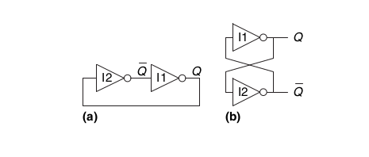
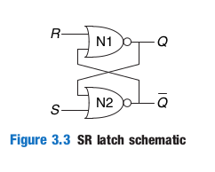
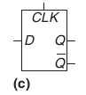
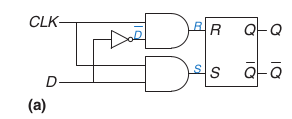
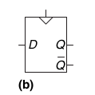

# A bistable element

An element with N states convey log2(N) bits of information -> bistable element stores one bit.

# SR latch (set-reset latch)

|R|S|Q|Q'|
|-|-|-|- |
|0|0|Q(t-1)|Q'(t-1)|
|0|1|1|0|
|1|0|0|1|
|1|1|0|0|

# D latch

Basically a foolproof version of SR latch with one input.

## Symbol:

## Ground truth table
|CLK|D|Q|Q'|
|-|-|-|- |
|0|X|Q(t-1)|Q'(t-1)|
|1|0|0|1|
|1|1|1|0|

## Implementation on gates

# D flip-flop

In general:
- flip flop is *edge triggered*
- latch is is *level triggered*

## Symbol

the triangle symbol on the input indicates that it is an edge-triggered input

## Function of D ff

D flip-flop copies D to Q on the rising edge of the clock.

## Register

An n-bit register is an array of n flip-flops sharing a common CLK signal

## Resetable flip-flop

A flip-flop with an additional RESET input, which forces a known state (i.e. 0) to the output.
This can happen either synchronously or asynchronously.

# Synchronous sequential circuits

SSC are circuits such that:

- there's at least one register
- every circuit element is either combinational logic or a register
- all registers receive the same clock
- every cyclic path contains at least one register

