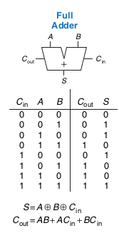

# Half adder

An adder without ```Cin``` (carry in) input

# Full adder

A binary adder with both ```Cin``` and ```Cout``` terminals



Full adder (1 bit)

# Ripple - carry adder

n (e.g. 32) full adders stacked together. The carry bit is passed from one input to the other - creating a 'ripple'. Computation would take 32t_FA (t_FA is the delay of a full adder).

# Carry-lookahead adder

Adders is devided into colums (e.g. 4 columns of 8 bits) and each column has:
- Generate output signal
- Propagate output signal

Assuming we have a 2 bit adder in i-th column
- Gi = Gi * Bi _(propagate if all bits are full)_
- Pi = Gi + Bi _(I don't know why...)_

The carry bit from a column will be calculated as follows:
- Ci = Gi + Pi * C(i-1) _see how this is recursive_


# Substraction

If we have addition, substraction is a piece of cake if we're using two's compliment numbers.
We simply add the opposite of the number.

# Comparators

## Equality comparator
Produces an output indicating whether A is equal to B

## Magniture comparator
Produces an output indicating _if_ and _how much_ A is greater than B

# ALU

ALU is an abbreviation for Arithmetic/Logical Unit.
Combines multiple operations, like:
- addition
- substraction
- magnitude comparison
- AND
- OR
- SLT _(set if less than)_


It has two inputs for numbers and F input to select the operation

# Shifters

## Logical shifter 

(switches logic levels)

``` 11001 ``` //in

```00110 ``` //out

## Arithmetic shifter

??

## Rotator

Rotates number in a cyclic buffer n times _(same stuff as << operator in C)_