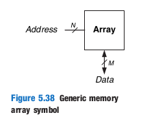
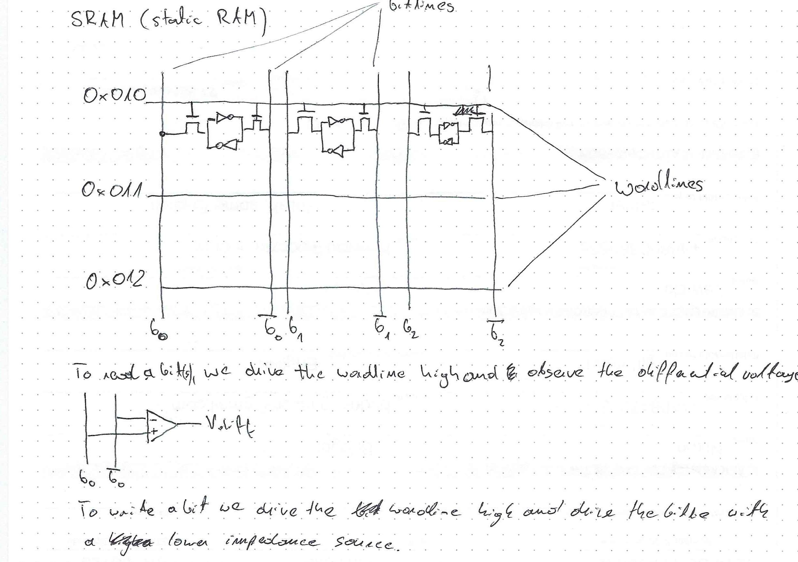
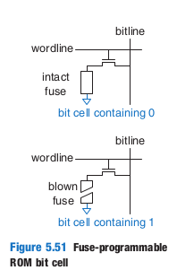

# Memory Arrays

General memory symbol

Memory arrays have N adresses (rows) and store words of length M (the array has M columns).

_depth_ of the array is the number of rows _(words)_
_width_ of the array is the number of collums _(cells)_

Memories are built with cells.

_wordline_ - selects an address (_word_) in the memory. A wordline drives all gates in the word, therefore if:
- wordline is 1 -> all memory cells in the word are connected to and driving their bitlines. Therefore, you can then read/write the data.

- wordline is 0 -> the gate floats and the cell holds its charge

_multiported_ memory is memory array type that can access several addresses simulatneously

# RAM, _volatile memory_
## SRAM (Static RAM)

- bits stored in a pair of inverters
- 

## DRAM (Dynamic RAM)

- bits stored in a capacitor
- must be refreshed every read and every given interval _(order of miliseconds)_

The popular _DDR SDRAM_ means _Double Data Rate Synchronous Dynamic RAM_ - it uses both the rising and falling edge of the clock for data read

# ROM, _non-volatile memory_

ROM stores the data as presence or absence of a transistor.

_PROM_ - programmable ROM

_EPROM_ - erasable PROM

_EEPROM_ - electronically erasable PROM

